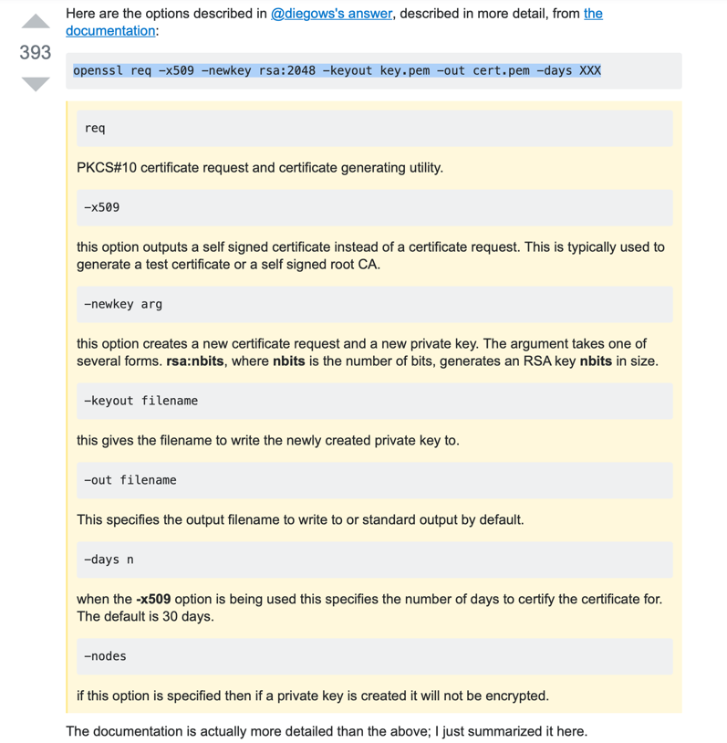

### Create self signed certificate and create secret with the key


#### Generate key
```markdown
openssl genrsa -out dashboard.key 2048
```


#### Generate certificate request, the csr file
```markdown
openssl req -days 3650 -new -out dashboard.csr -key dashboard.key -subj '/CN=**192.168.100.6**'
```

#### Generate certificate
```markdown
openssl x509 -req -in dashboard.csr -signkey dashboard.key -out dashboard.crt
```


#### Create secret
```markdown
kubectl create secret generic kubernetes-dashboard-certs --from-file=dashboard.key --from-file=dashboard.crt
```


#### Create key and crt in one command

```
openssl req -newkey rsa:2048 -nodes -keyout server.key -x509 -days 365 -out server.crt

openssl req -x509 -newkey rsa:2048 -keyout key.pem -out cert.pem -days XXX
```

