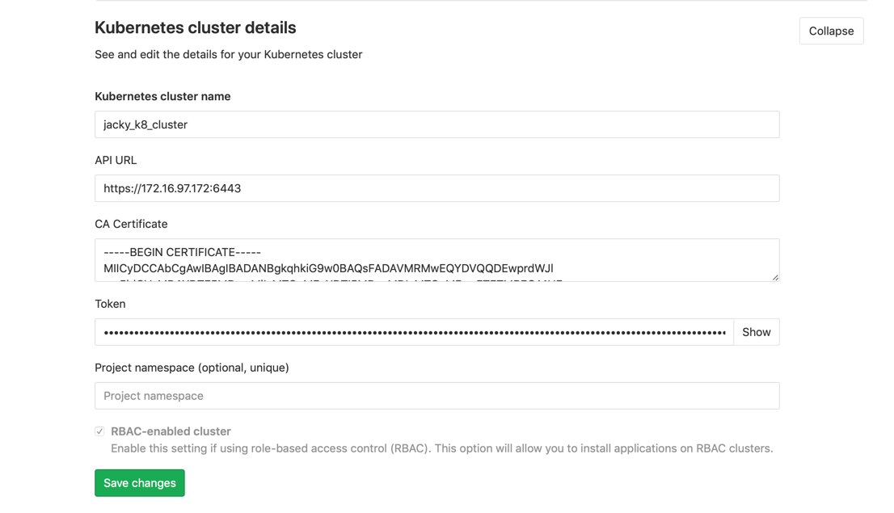

### token

- For example, in gitlab, there is one page to add existing cluster page.



There are there params necessary,

- Api Url
- CA Certificate
- Token


### Command
 
```

kubectl cluster-info | grep 'Kubernetes master' | awk '/http/ {print $NF}'

```


```

kubectl get secrets, and one should named similar to default-token-xxxxx

kubectl get secret <secret name> -o jsonpath="{['data']['ca\.crt']}" | base64 --decode

```

Token - GitLab authenticates against Kubernetes using service tokens, which are scoped to a particular namespace. The token used should belong to a service account with cluster-admin privileges